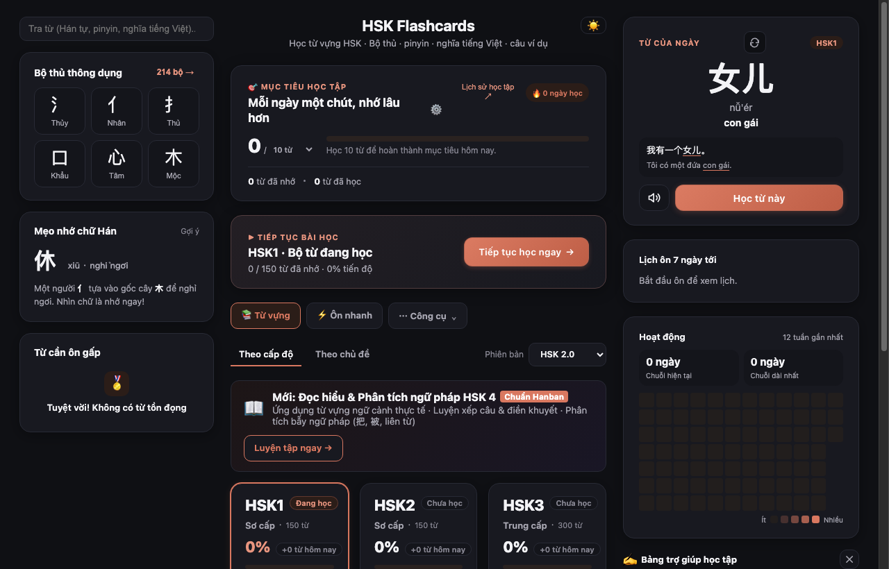
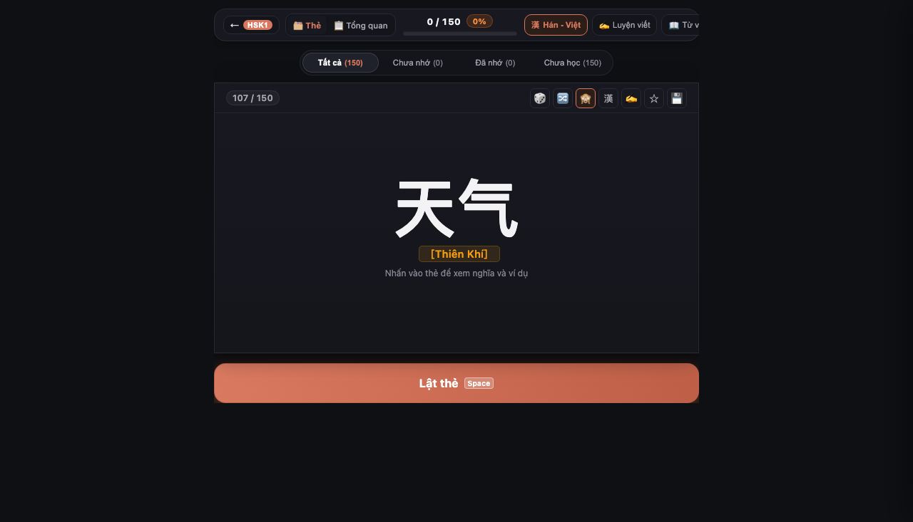
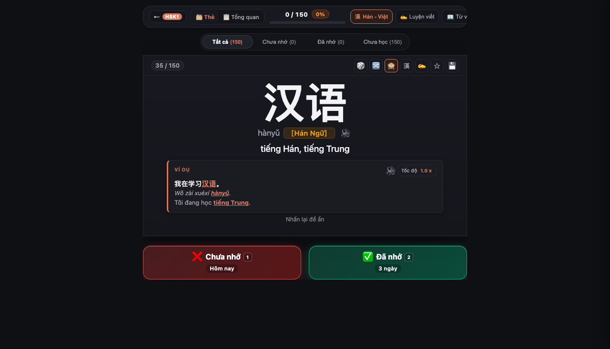
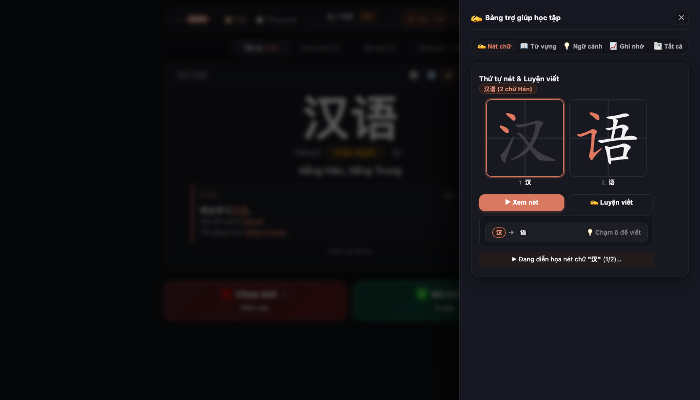
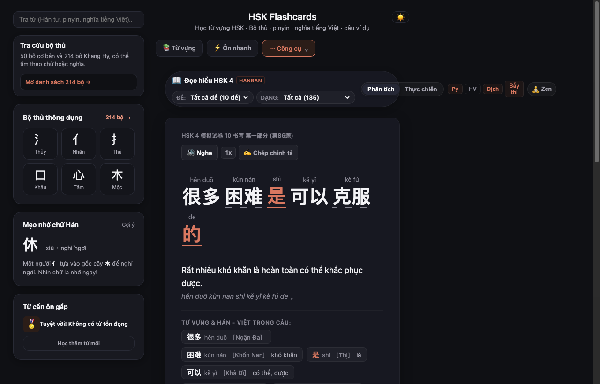
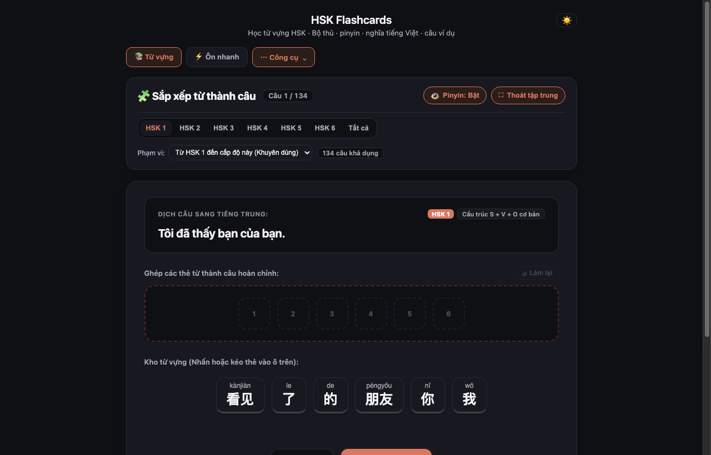
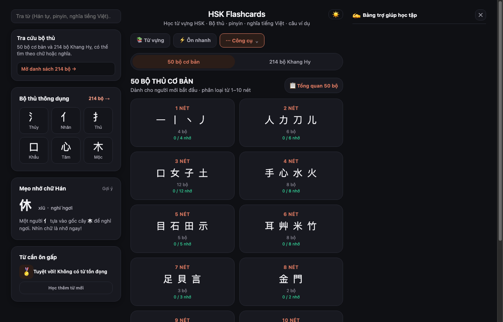

# 🀄 HSK Flashcards & Reading Analysis (HSK 1–9)

> **Ứng dụng web học tiếng Trung hiện đại, tối giản và 100% Offline (PWA).**  
> Kết hợp thuật toán **Spaced Repetition (FSRS)**, phân tích ngữ pháp đọc hiểu **HSK 4 Chuẩn Hanban**, luyện viết chữ Hán và tra cứu âm Hán - Việt. Không cần cài đặt Node.js hay build phức tạp.

<p align="center">
  <a href="https://nguyenhau442001.github.io/HSK-Flashcards-Generator/">
    
  </a>
  
  
  
</p>

---

## 📸 Giao diện ứng dụng (Visual Tour)

### 1. 🎯 Bảng điều khiển học tập (Dashboard)
Theo dõi mục tiêu học tập hàng ngày, chuỗi ngày học (Streak 🔥), từ vựng của ngày và biểu đồ đóng góp (Heatmap).

<p align="center">
  
</p>

---

### 2. 🎴 Thẻ Flashcard tối giản & Nút bấm độ tương phản cao
Thiết kế tập trung tuyệt đối vào từ vựng (Hero Layout), thanh công cụ gom gọn trên viền thẻ, thao tác lật thẻ và chấm điểm siêu nhanh:
- ❌ **Chưa nhớ [Phím 1 / ← / Vuốt trái]**: Đưa từ vào danh sách ôn tập ngay trong ngày.
- ✅ **Đã nhớ [Phím 2 / → / Vuốt phải]**: Tự động tính toán chu kỳ lặp lại ngắt quãng FSRS.

<p align="center">
  
  
</p>

---

### 3. ✍️ Luyện viết chữ Hán tương tác (Hanzi Writer)
Bảng phụ trợ (Slide-over Drawer) mô phỏng từng nét viết bút thuận bằng animation và bảng vẽ Canvas tự luyện viết trực tiếp bằng chuột hoặc cảm ứng.

<p align="center">
  
</p>

---

### 4. 📖 Đọc hiểu & Phân tích ngữ pháp HSK 4 (Chuẩn Hanban)
Phân tích cấu trúc câu chuyên sâu (Chủ ngữ - Vị ngữ - Tân ngữ, liên từ), bẫy thi thường gặp, từ loại, phiên âm và âm Hán - Việt theo ngữ cảnh. Hỗ trợ **Zen Mode** tập trung cao độ.

<p align="center">
  
</p>

---

### 5. 🧩 Phòng thực hành & Trò chơi củng cố phản xạ
Rèn luyện cấu trúc ngữ pháp qua game **Sắp xếp từ thành câu (Sentence Game)**, Đoán từ (Guess Word) và Speed Quiz.

<p align="center">
  
</p>

---

### 6. 🀄 Trọn bộ 50 & 214 Bộ thủ Khang Hy
Tra cứu và học bộ thủ theo số nét, ý nghĩa, ví dụ và thống kê tiến độ riêng biệt.

<p align="center">
  
</p>

---

## ⚡ Điểm nổi bật & Tính năng cốt lõi

- **Kho từ vựng khổng lồ:**
  - **HSK 2.0:** Đầy đủ 5.000 từ vựng cốt lõi HSK 1 đến HSK 6.
  - **HSK 3.0 mới:** Hơn 11.000 từ vựng theo khung khảo thí quốc tế (Cấp 1–9).
  - **Bộ thủ:** 50 bộ thủ cơ bản & 214 bộ thủ Khang Hy.
  - **Từ vựng theo chủ đề:** Công nghệ thông tin (IT), Du lịch, Kinh doanh...
- **Spaced Repetition tối ưu:** Thuật toán FSRS v5 tự động tính toán thời điểm ôn tập khoa học, dự đoán tỷ lệ nhớ theo đường cong Ebbinghaus.
- **Tự động gắn âm Hán - Việt:** Giúp người Việt hiểu nghĩa gốc sâu sắc và ghi nhớ từ vựng nhanh gấp đôi.
- **Âm thanh giọng thật & Web Speech API:** Nghe phát âm từ vựng và câu ví dụ, tùy chỉnh tốc độ đọc từ 0.25x đến 2.0x.
- **SPA Router thông minh:** Hỗ trợ nút Back/Forward vật lý của trình duyệt và chia sẻ liên kết trực tiếp (Deep Linking) mà không tải lại trang.
- **Offline 100% (PWA):** Cài đặt làm ứng dụng độc lập trên điện thoại (iOS, Android) và máy tính, học mọi lúc mọi nơi không cần Internet.

---

## ⌨️ Phím tắt bàn phím (Desktop Shortcuts)

| Phím tắt | Thao tác nhanh |
| :---: | :--- |
| `Space` / `Enter` | **Lật thẻ** (Xem mặt sau / Ẩn mặt sau) |
| `1` hoặc `←` | Đánh dấu **❌ Chưa nhớ** (Ôn lại hôm nay) |
| `2` hoặc `→` | Đánh dấu **✅ Đã nhớ** (Tăng chu kỳ SRS) |
| `R` | Ngẫu nhiên nhảy đến một từ bất kỳ |
| `H` | Bật / Tắt hiển thị **âm Hán - Việt** |
| `W` | Mở / Đóng bảng **Luyện viết chữ Hán** & Bút thuận |
| `B` | Mở / Đóng ngăn kéo **Danh sách từ vựng** trong bài |

---

## 💻 Hướng dẫn chạy cục bộ (Local Development)

Không cần cài đặt Node.js hay npm:

```bash
# 1. Clone repository
git clone https://github.com/nguyenhau442001/HSK-Flashcards-Generator.git
cd HSK-Flashcards-Generator

# 2. Khởi chạy HTTP server (bằng Python 3)
python3 -m http.server 8000
```

Mở trình duyệt truy cập: **`http://localhost:8000/`**

---

## 🔒 Lưu trữ & Bản sao tiến trình

- Dữ liệu học tập được tự động lưu trong `localStorage` của trình duyệt.
- Dễ dàng chuyển đổi giữa các thiết bị tại mục **Sao lưu và chuyển thiết bị**:
  - **💾 Tải bản sao tiến trình:** Tải file `.json` nhẹ ~15KB.
  - **📂 Khôi phục từ bản sao:** Chọn file `.json` để tiếp tục phiên học trên máy mới.

---

## 👨‍💻 Tác giả & Giấy phép

- **Tác giả:** [Nguyễn Ngọc Hậu (haunguyenngoc442001)](https://github.com/nguyenhau442001)
- **Giấy phép:** Open Source - [MIT License](LICENSE).
